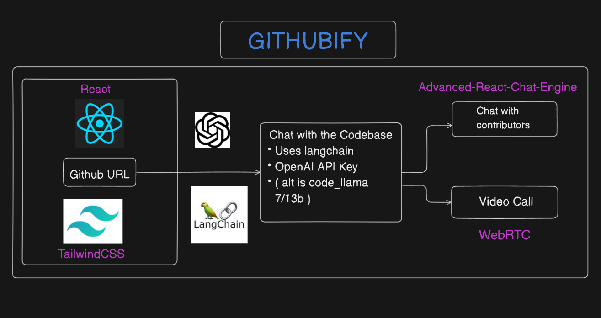
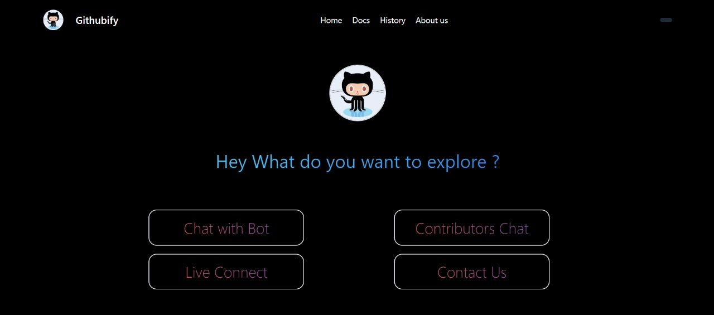
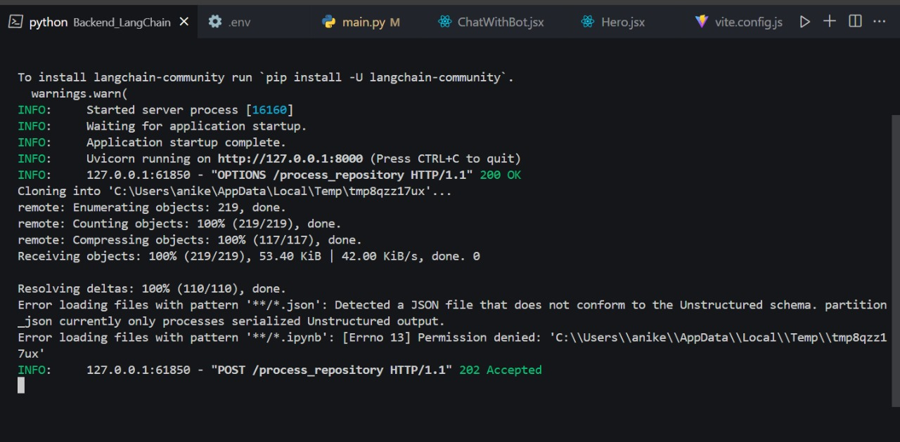
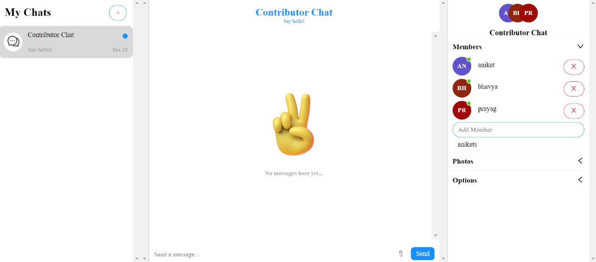
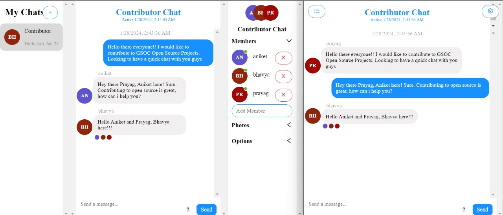

# GITHUBIFY 
~ Understanding codebases made easier ⚡⚡

Welcome to **Project GITHUBIFY**! 🚀

Feel free to explore the Eraser workspace [Here 👨‍💻](https://app.eraser.io/workspace/Z9dLps6TNrTbcQoYyGQZ).

- Chat with our bot to understand complex codebases and get a better understanding of the codebase. 
- Reduces the time taken to understand codebases by 50% and increases productivity by 2x. 
- Plus, senior developers can focus on more important tasks rather than explaining the codebase to the newbies.
- The bot uses Langchain API to understand the codebase, vectorize it, and then uses OpenAI API to generate responses to the user's queries.
- The bot also has a chat with fellow contributors and a video call feature.

# Preview 

## Features 🌟

### Explore Section

### 🚀 Cloning repo and processing with LangChain and OpenAI API

###  Advanced Chat Engine  

### 🌐 MultiUser Real-Time Chat 

## Thank You!! Team ETHEREUM BOTS 🤖
